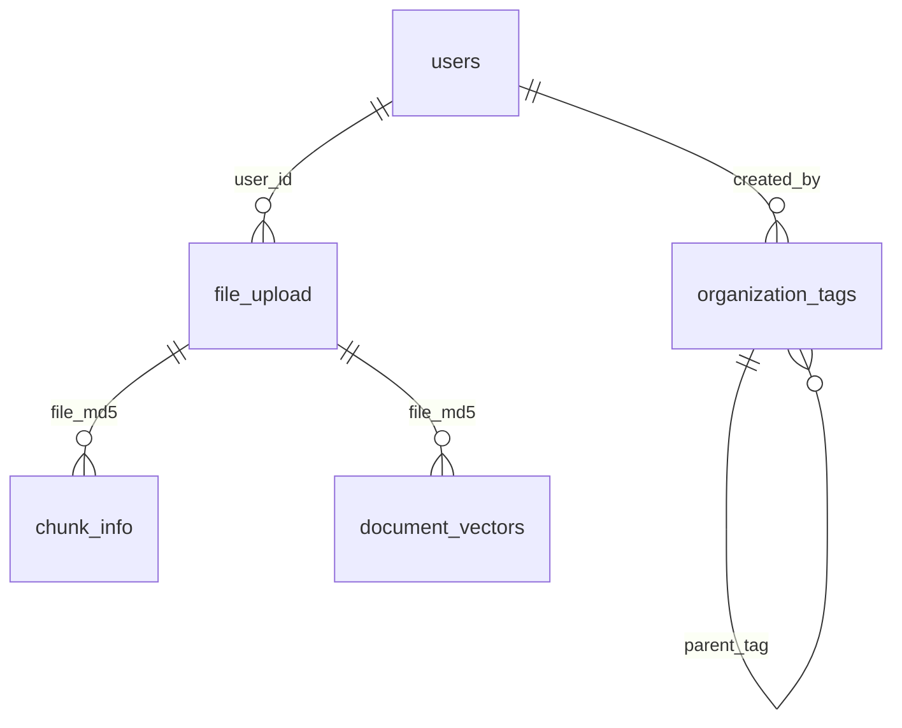
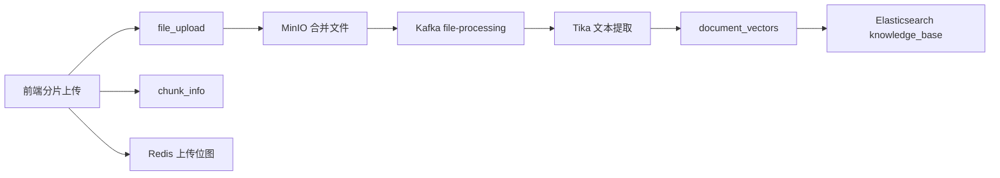

# 数据库设计文档

> 基于 `docs/ddl.sql`、`internal/model/*`、`internal/repository/*` 整理。当前项目既使用 MySQL，也使用 Redis、Elasticsearch 和 Kafka 承担部分“数据层”职责，本文档会一并说明。

## 1. 数据存储总览

### 1.1 存储分工

| 组件 | 用途 |
| --- | --- |
| MySQL | 用户、组织标签、上传记录、分片信息、文档分块元数据 |
| Redis | 上传进度位图、JWT 黑名单、当前会话 ID、聊天历史、Kafka 失败计数 |
| Elasticsearch | 文档向量与全文检索索引 |
| MinIO | 文件分片、合并后文件对象 |
| Kafka | 文件处理异步任务队列 |

### 1.2 MySQL 逻辑关系



补充说明：

- `users.org_tags` 不是中间表，而是逗号分隔字符串，属于反规范化设计
- `file_upload.org_tag` 与 `document_vectors.org_tag` 保存的是单个组织标签编码
- 会话历史当前实际保存在 Redis，不在 MySQL 落表

## 2. MySQL 表设计

## 2.1 `users`

用途：系统用户主表。

| 字段 | 类型 | 约束 | 说明 |
| --- | --- | --- | --- |
| `id` | `BIGINT` | PK, AUTO_INCREMENT | 用户主键 |
| `username` | `VARCHAR(255)` | NOT NULL, UNIQUE | 用户名 |
| `password` | `VARCHAR(255)` | NOT NULL | BCrypt 密码哈希 |
| `role` | `ENUM('USER','ADMIN')` | NOT NULL, DEFAULT `'USER'` | 用户角色 |
| `org_tags` | `VARCHAR(255)` | NULL | 所属组织标签列表，逗号分隔 |
| `primary_org` | `VARCHAR(50)` | NULL | 当前主组织标签 |
| `created_at` | `TIMESTAMP` | DEFAULT CURRENT_TIMESTAMP | 创建时间 |
| `updated_at` | `TIMESTAMP` | DEFAULT CURRENT_TIMESTAMP ON UPDATE CURRENT_TIMESTAMP | 更新时间 |

索引：

- `PRIMARY KEY (id)`
- `UNIQUE KEY (username)`
- `INDEX idx_username (username)`

设计说明：

- 注册时自动创建 `PRIVATE_<username>` 私有标签
- `primary_org` 必须属于 `org_tags` 中的一项，但当前依赖业务代码校验

## 2.2 `organization_tags`

用途：组织标签与层级结构表。

| 字段 | 类型 | 约束 | 说明 |
| --- | --- | --- | --- |
| `tag_id` | `VARCHAR(255)` | PK | 组织标签唯一编码 |
| `name` | `VARCHAR(100)` | NOT NULL | 标签名称 |
| `description` | `TEXT` | NULL | 标签描述 |
| `parent_tag` | `VARCHAR(255)` | FK, NULL | 父标签 ID，支持树形结构 |
| `created_by` | `BIGINT` | FK, NOT NULL | 创建人用户 ID |
| `created_at` | `TIMESTAMP` | DEFAULT CURRENT_TIMESTAMP | 创建时间 |
| `updated_at` | `TIMESTAMP` | DEFAULT CURRENT_TIMESTAMP ON UPDATE CURRENT_TIMESTAMP | 更新时间 |

外键：

- `parent_tag -> organization_tags.tag_id`
- `created_by -> users.id`

设计说明：

- 同时承担组织权限与文档归属标签
- 树结构支持从叶子标签向上回溯父级标签，供搜索权限扩展使用

## 2.3 `file_upload`

用途：文件上传主记录。

| 字段 | 类型 | 约束 | 说明 |
| --- | --- | --- | --- |
| `id` | `BIGINT` | PK, AUTO_INCREMENT | 上传记录主键 |
| `file_md5` | `VARCHAR(32)` | NOT NULL | 文件 MD5 |
| `file_name` | `VARCHAR(255)` | NOT NULL | 原始文件名 |
| `total_size` | `BIGINT` | NOT NULL | 文件总大小，字节 |
| `status` | `TINYINT` | NOT NULL, DEFAULT `0` | 上传状态，`0` 上传中，`1` 已完成，`2` 失败 |
| `user_id` | `VARCHAR(64)` | NOT NULL | 上传人 ID |
| `org_tag` | `VARCHAR(50)` | NULL | 文件归属组织标签 |
| `is_public` | `TINYINT(1)` | NOT NULL, DEFAULT `0` | 是否公开 |
| `created_at` | `TIMESTAMP` | NOT NULL, DEFAULT CURRENT_TIMESTAMP | 创建时间 |
| `merged_at` | `TIMESTAMP` | NULL | 合并完成时间 |

索引与约束：

- `PRIMARY KEY (id)`
- `UNIQUE KEY uk_md5_user (file_md5, user_id)`
- `INDEX idx_user (user_id)`
- `INDEX idx_org_tag (org_tag)`

设计说明：

- 以 `file_md5 + user_id` 保证同用户上传同一文件只有一条主记录
- 组织权限与公开权限都固化在主记录，便于后续检索和预览

代码注意事项：

- GORM 模型里 `UserID` 类型为 `uint`，DDL 里为 `VARCHAR(64)`，类型不完全一致
- 当前系统未给 `user_id` 建立外键

## 2.4 `chunk_info`

用途：文件分片上传记录。

| 字段 | 类型 | 约束 | 说明 |
| --- | --- | --- | --- |
| `id` | `BIGINT` | PK, AUTO_INCREMENT | 分片记录主键 |
| `file_md5` | `VARCHAR(32)` | NOT NULL | 所属文件 MD5 |
| `chunk_index` | `INT` | NOT NULL | 分片序号，从 0 开始 |
| `chunk_md5` | `VARCHAR(32)` | NOT NULL | 分片 MD5 |
| `storage_path` | `VARCHAR(255)` | NOT NULL | MinIO 分片对象路径 |

设计说明：

- 当前 Go 实现里 `chunk_md5` 暂未实际计算，写入时为空字符串
- MinIO 路径采用：`chunks/{fileMd5}/{chunkIndex}`

## 2.5 `document_vectors`

用途：文档分块元数据持久化表。

| 字段 | 类型 | 约束 | 说明 |
| --- | --- | --- | --- |
| `vector_id` | `BIGINT` | PK, AUTO_INCREMENT | 分块主键 |
| `file_md5` | `VARCHAR(32)` | NOT NULL | 所属文件 MD5 |
| `chunk_id` | `INT` | NOT NULL | 分块序号 |
| `text_content` | `TEXT` | NULL | 分块文本内容 |
| `model_version` | `VARCHAR(32)` | NULL | 向量模型版本 |
| `user_id` | `VARCHAR(64)` | NOT NULL | 上传用户 ID |
| `org_tag` | `VARCHAR(50)` | NULL | 文档组织标签 |
| `is_public` | `TINYINT(1)` | NOT NULL, DEFAULT `0` | 是否公开 |

设计说明：

- 该表保存切块文本和权限元信息
- 真正的向量值不落 MySQL，而写入 Elasticsearch 的 `dense_vector`

代码注意事项：

- GORM 模型中的 `model_version` 长度为 `VARCHAR(50)`，DDL 为 `VARCHAR(32)`
- `user_id` 同样存在 `uint` 与 `VARCHAR(64)` 的类型不一致问题

## 2.6 `conversations`

说明：

- `internal/model/conversation.go` 中存在 `Conversation` 模型
- 但当前 `docs/ddl.sql` 未创建该表
- 当前会话历史实际由 `ConversationRepository` 存在 Redis 中
- 因此现阶段可视为“预留模型，未落库”

## 3. Redis 设计

Redis 在本项目中承担高频状态存储。

### 3.1 上传进度位图

| Key 模式 | 类型 | 说明 |
| --- | --- | --- |
| `upload:{userId}:{fileMd5}` | Bitmap/String | 每一位表示一个分片是否上传完成 |

说明：

- 第 `n` 位为 `1` 表示第 `n` 个分片已上传
- 合并完成后会删除该 key

### 3.2 JWT 黑名单

| Key 模式 | 类型 | 说明 |
| --- | --- | --- |
| `blacklist:{token}` | String | 退出登录后的 access token |

说明：

- 过期时间设置为 token 剩余有效期

### 3.3 当前会话映射

| Key 模式 | 类型 | 说明 |
| --- | --- | --- |
| `user:{userId}:current_conversation` | String | 当前用户会话 ID |

说明：

- TTL 为 7 天

### 3.4 会话历史

| Key 模式 | 类型 | 说明 |
| --- | --- | --- |
| `conversation:{conversationId}` | String(JSON) | 用户最近会话消息列表 |

说明：

- 存储为 JSON 数组
- 最多保留最近 20 条消息
- TTL 为 7 天

### 3.5 Kafka 失败重试计数

| Key 模式 | 类型 | 说明 |
| --- | --- | --- |
| `kafka:attempts:{fileMd5}` | String/Counter | 文件处理失败重试次数 |

说明：

- 失败 3 次后提交 Kafka offset，停止继续重试

## 4. Elasticsearch 设计

索引名：`knowledge_base`

字段结构：

| 字段 | 类型 | 说明 |
| --- | --- | --- |
| `vector_id` | `keyword` | 唯一文档 ID，格式 `fileMd5_chunkId` |
| `file_md5` | `keyword` | 文件 MD5 |
| `chunk_id` | `integer` | 分块序号 |
| `text_content` | `text` | 分块内容，使用 IK 分词 |
| `vector` | `dense_vector` | 2048 维向量 |
| `model_version` | `keyword` | 向量模型版本 |
| `user_id` | `long` | 上传用户 ID |
| `org_tag` | `keyword` | 组织标签 |
| `is_public` | `boolean` | 是否公开 |

说明：

- `text_content` 使用 `ik_max_word` / `ik_smart`
- `vector` 使用 `cosine` 相似度
- 搜索时结合 `knn`、`match`、`rescore` 和权限过滤

## 5. Kafka 设计

Topic：

- `file-processing`
- `vectorization` 已在 Compose 中预创建，但当前 Go 代码未消费

消息结构：

```json
{
  "file_md5": "string",
  "object_url": "string",
  "file_name": "string",
  "user_id": 1,
  "org_tag": "TEAM_RD",
  "is_public": true
}
```

## 6. 数据流设计

### 6.1 文件上传到入库



### 6.2 聊天数据流


## 7. 当前设计的优点与限制

### 7.1 优点

1. MySQL 只保存元数据，向量交给 ES，职责清晰
2. Redis 承担上传位图和会话缓存，读写开销低
3. Kafka 解耦上传与解析链路，避免用户请求阻塞
4. 组织标签树支持多租户与层级权限扩展

### 7.2 限制

1. `users.org_tags` 采用逗号分隔字符串，不利于标准化查询
2. `file_upload.user_id`、`document_vectors.user_id` 与 Go 模型类型不完全一致
3. `chunk_info` 未建立 `(file_md5, chunk_index)` 唯一约束
4. 聊天历史仅存 Redis，重启或过期后会丢失
5. `conversations` 模型与 DDL 不一致，存在“模型已定义、表未启用”的状态

## 8. 建议优化方向

1. 新增 `user_org_tags` 关联表，替代 `users.org_tags` 字符串存储
2. 统一 `user_id` 字段类型为 `BIGINT`
3. 为 `chunk_info(file_md5, chunk_index)` 增加唯一索引
4. 如需长期审计，新增会话历史 MySQL 落表方案
5. 为 `file_upload` 和 `document_vectors` 增加外键或至少保持字段类型一致
